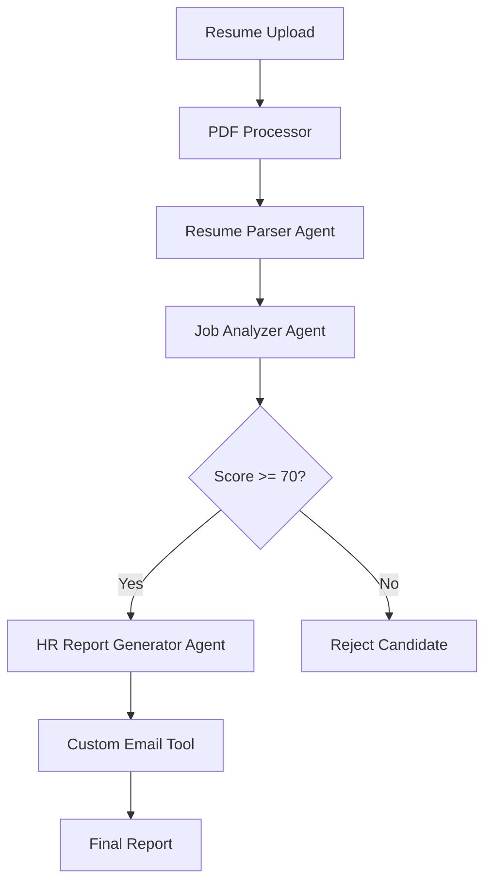

# 🤖 HR Assistant Agent - LangChain Edition

**AI-Powered Recruitment Automation with Beautiful Streamlit UI**

A sophisticated multi-agent system built with **LangChain** for automated resume screening, job matching, and interview preparation. This demonstrates the same HR workflow as the Google ADK version but with **LangChain framework** and a **stunning Streamlit frontend**.

## 🚀 Features

### 🤖 **Multi-Agent Architecture**

- **Agent 1**: Resume Parser (extracts and structures resume data)
- **Agent 2**: Job Analyzer (scores candidates based on job fit)
- **Agent 3**: HR Report Generator (creates interview questions and email templates)

### 📊 **Beautiful Streamlit UI**

- **File Upload**: PDF, DOCX, TXT resume processing
- **Interactive Visualizations**: Score gauges, skills charts
- **Real-time Processing**: Progress bars and status updates
- **Professional Results**: Tabbed interface with downloadable reports

### 🔧 **Advanced Features**

- **Custom Tools**: Email template generator with LangChain Tools
- **Free Models**: Uses Gemini 2.0 Flash (no cost)
- **Robust Processing**: Multiple PDF extraction methods
- **Score Threshold**: Automatic rejection below 70/100
- **Export Capability**: Download results as JSON

## 📋 Requirements

```txt
# Core LangChain & AI
langchain==0.1.0
langchain-openai==0.0.5
langchain-google-genai==0.0.11
langchain-community==0.0.10
streamlit==1.29.0

# Document Processing
PyPDF2==3.0.1
pdfplumber==0.9.0
python-docx==0.8.11

# Visualization & Utils
pandas==2.1.4
plotly==5.17.0
python-dotenv==1.0.0
```

## ⚡ Quick Start

### 1. **Setup Environment**

```bash
# Create virtual environment
python -m venv .venv

# Activate (Windows)
.venv\Scripts\activate

# Activate (Mac/Linux)
source .venv/bin/activate

# Install dependencies
pip install -r requirements.txt
```

### 2. **Configure API Keys**

Create `.env` file or set environment variables:

```bash
GOOGLE_API_KEY=your_google_api_key_here
OPENAI_API_KEY=your_openai_api_key_here  # Optional
```

### 3. **Launch Application**

```bash
streamlit run streamlit_app.py
```

Navigate to `http://localhost:8501` in your browser! 🌐

## 🎯 Usage Guide

### **Step 1: Upload Resume**

- **Drag & Drop** PDF, DOCX, or TXT files
- **Or paste** resume text directly
- **View extracted** text to verify

### **Step 2: Define Job Requirements**

- **Enter job description** and requirements
- **Use demo data** for quick testing
- **Specify skills** and experience needed

### **Step 3: Process Candidate**

- **Click "Process Candidate"** button
- **Watch progress** through 3 agent steps
- **View results** in beautiful interface

### **Step 4: Review Results**

- **📊 Overview**: Score gauge & skills chart
- **📄 Parsed Resume**: Structured candidate data
- **🔍 Analysis**: Detailed matching & scoring
- **📧 HR Report**: Interview questions & email template

## 🧪 Test Cases

### **Test Case 1: Strong AI Candidate**

```txt
John Smith
Email: john.smith@email.com
Phone: (555) 123-4567

EXPERIENCE:
• Senior AI Engineer at TechCorp (2021-2024) - 3 years
• Developed LLM applications using Python, TensorFlow, PyTorch
• Built recommendation systems serving 1M+ users
• Published 5 research papers on machine learning

EDUCATION:
• MS Computer Science, Stanford University (2021)
• BS Computer Science, MIT (2019)

SKILLS:
Python, TensorFlow, PyTorch, LangChain, AWS, Docker, Kubernetes

CERTIFICATIONS:
• Google Cloud Professional ML Engineer
• AWS Certified Machine Learning Specialist
```

**Expected Result**: Score 85-95/100, PROCEED recommendation

### **Test Case 2: Junior Developer**

```txt
Sarah Johnson
Email: sarah.j@email.com
Phone: (555) 987-6543

EXPERIENCE:
• Junior Developer at StartupXYZ (2023-2024) - 1 year
• Built web applications using React and Node.js
• Basic Python scripting for automation

EDUCATION:
• BS Computer Science, Local University (2023)

SKILLS:
JavaScript, React, Node.js, HTML, CSS, Basic Python
```

**Expected Result**: Score 45-65/100, REJECT recommendation

## 🏗️ Architecture

### **LangChain Multi-Agent Flow**



### **File Structure**

```
HR_LANGCHAIN/
├── streamlit_app.py      # Main Streamlit UI
├── agents.py             # LangChain multi-agent system
├── pdf_processor.py      # Document processing utilities
├── requirements.txt      # Python dependencies
├── README.md             # This documentation
└── .env                  # API keys (create this)
```

## 🔧 Technical Details

### **LangChain Components Used**

- **ChatGoogleGenerativeAI**: Gemini 2.0 Flash model
- **Tool**: Custom email generation function
- **AgentExecutor**: Tool-enabled agent orchestration
- **ConversationBufferMemory**: Session memory
- **SystemMessage/HumanMessage**: Prompt management

### **Streamlit Features**

- **File Uploader**: Multi-format resume processing
- **Progress Bars**: Real-time processing feedback
- **Plotly Charts**: Interactive visualizations
- **Session State**: Persistent results storage
- **CSS Styling**: Beautiful gradient designs

### **Error Handling**

- **PDF Extraction**: Multiple methods (pdfplumber + PyPDF2)
- **Model Fallback**: OpenAI → Gemini if unavailable
- **JSON Parsing**: Robust response cleaning
- **Tool Failures**: Graceful degradation with fallback responses

## 🆚 Comparison with Google ADK Version

| Feature               | Google ADK    | LangChain       |
| --------------------- | ------------- | --------------- |
| **Framework**         | Google ADK    | LangChain       |
| **UI**                | Web interface | Streamlit       |
| **File Upload**       | Text only     | PDF/DOCX/TXT    |
| **Visualizations**    | Basic         | Rich (Plotly)   |
| **Custom Tools**      | FunctionTool  | LangChain Tool  |
| **Models**            | Gemini only   | Gemini + OpenAI |
| **Progress Tracking** | None          | Real-time       |
| **Export**            | None          | JSON download   |

## 🎨 UI Screenshots

**Main Interface:**

- Beautiful gradient header
- Side-by-side upload & job requirements
- Professional agent cards with glassmorphism effects

**Results Dashboard:**

- Score gauge with threshold indicators
- Skills matching bar charts
- Tabbed detailed results
- Download capabilities

## 🐛 Troubleshooting

### **Common Issues**

1. **"No module named 'langchain'"**

   ```bash
   pip install langchain==0.1.0
   ```

2. **"Invalid API key"**

   - Check `.env` file or environment variables
   - Verify Google API key has Generative AI access

3. **"PDF extraction failed"**

   - Try different PDF or use text input
   - Check file is not password protected

4. **"Tool execution failed"**
   - Normal fallback behavior
   - Report still generated without custom email

### **Performance Tips**

- **Use smaller PDFs** (< 5MB) for faster processing
- **Clear browser cache** if Streamlit acts slowly
- **Restart app** if models become unresponsive

## 🚀 Deployment Options

### **Local Development**

```bash
streamlit run streamlit_app.py
```

### **Streamlit Cloud**

1. Push to GitHub repository
2. Connect to Streamlit Cloud
3. Add secrets for API keys
4. Deploy automatically

### **Docker Deployment**

```dockerfile
FROM python:3.9-slim
COPY . /app
WORKDIR /app
RUN pip install -r requirements.txt
EXPOSE 8501
CMD ["streamlit", "run", "streamlit_app.py"]
```

## 🤝 Contributing

This project demonstrates:

- **LangChain Framework** usage
- **Multi-agent orchestration**
- **Custom tool integration**
- **Beautiful Streamlit UI design**
- **Real-world HR automation**

Perfect for showcasing in **interviews** or **portfolio projects**!

## 📜 License

MIT License - Feel free to use in your projects!

---

**Built with ❤️ using LangChain + Streamlit + Gemini 2.0 Flash**
